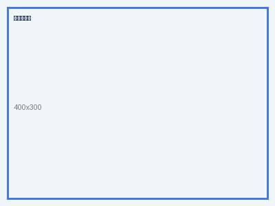

# 产品说明

本文档介绍我们知识库系统的核心能力与私有化部署方式。

## 系统架构

下图展示了整体架构：

架构分为接入层、处理层与存储层三层，分别负责请求接入、文档解析切块与向量存储。

## 部署流程

部署时请参考下面的流程图，按步骤执行即可完成私有化部署：

第一步准备环境，第二步启动服务，第三步导入知识文档。

## 常见问题

问：支持哪些文件格式？
答：支持 PDF、Word、Markdown、HTML、CSV 等常见格式。

问：图片内容能被检索吗？
答：开启 OCR 后，图片中的文字会进入切片并被检索。
